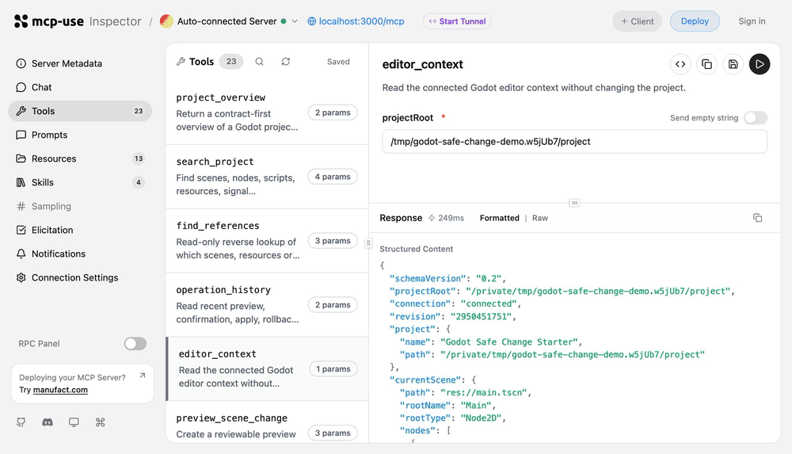

  

<h1 align="center">Godot Safe Change MCP</h1>

  Reviewable, confirmable, and rollback-safe Godot changes for AI agents.

  
  
  
  
  

English · <a href="README.zh-CN.md">简体中文</a>

Godot Safe Change MCP is an MCP server for AI-assisted Godot development. TypeScript owns contracts, preview plans, confirmation, task orchestration, and audit evidence; the Godot EditorPlugin owns live editor context, UndoRedo, run control, and diagnostics.

The server does not expose arbitrary Godot RPC. Every write follows a bounded lifecycle:

> Inspect context → preview a diff → confirm → acquire a project lease → apply through Godot UndoRedo → verify → rollback safely when needed

  

A real local MCP Inspector view of the server tools.

  

A real starter fixture workflow: context → search → preview → confirm → apply → rollback.

## Why this project

- **Intent-level tools, not arbitrary RPC**: create, move, instantiate, edit, run, and verify bounded Godot operations.
- **Evidence for every write**: preview diff, expected revision, explicit confirmation, operation ID, UndoRedo report, and rollback evidence.
- **Safe multi-window work**: project leases, heartbeat renewal, TTL takeover, and stable PROJECT_BUSY responses.
- **Real Godot verification**: GitHub Actions runs the same EditorPlugin fixture against Godot 4.5.1 and 4.7.2.

## Quick Start

### Requirements

- Node.js 22.22.2 or newer
- A Godot 4.x editor; CI currently verifies 4.5.1 and 4.7.2
- An MCP-capable agent client

### 1. Install and start the MCP server

~~~bash
git clone https://github.com/LJH-snow/godot-safe-change-mcp.git
cd godot-safe-change-mcp
npm ci
npm run build
npm run dev
~~~

The development server exposes:

- MCP endpoint: <code>http://127.0.0.1:3000/mcp</code>
- Inspector: <code>http://127.0.0.1:3000/mcp/inspector</code>
- Godot bridge: <code>http://127.0.0.1:8765</code> by default

Override the bridge with <code>GODOT_BRIDGE_URL</code> when needed.

### 2. Install the Godot plugin

Copy <code>godot-plugin</code> into the target project:

~~~text
your-godot-project/addons/godot-safe-change-bridge/
~~~

Enable **Godot Safe Change Bridge** in Project → Project Settings → Plugins. The plugin listens only on loopback at <code>127.0.0.1:8765</code>.

### 3. Connect an MCP client

Add this Streamable HTTP server to the client:

~~~text
http://127.0.0.1:3000/mcp
~~~

Or run the built entry point directly:

~~~bash
npm run build
node bin/mcp-server.mjs
~~~

## Using the Inspector

The Inspector is the local MCP debugging UI provided by mcp-use. Running <code>npm ci</code> or <code>npm install</code> installs the locked <code>@mcp-use/inspector</code> package into <code>node_modules</code>; starting the server does not download it again on every run.

Use it as follows:

1. Start Godot and enable Godot Safe Change Bridge.
2. Run <code>npm run dev</code> from the project root; this starts the development server and loads the Inspector.
3. Open <code>http://127.0.0.1:3000/mcp/inspector</code> if the browser does not open automatically.
4. In **Tools**, call <code>editor_context</code> first and check the current scene, full node tree, and connection state.
5. Use <code>search_project</code> or <code>find_references</code> to verify read-only project intelligence.
6. For writes, keep the lifecycle explicit: <code>preview_scene_change</code> → <code>confirm_scene_change</code> → <code>apply_scene_change</code> → <code>rollback_scene_change</code>.
7. Use <code>operation_history</code>, <code>task_status</code>, and <code>task_timeline</code> to inspect audit, lease, and recovery evidence.

To debug without opening a browser, or to disable the UI entirely:

~~~bash
npm run dev -- --no-open
npm run dev -- --no-inspector
~~~

The Inspector is for local development, manual acceptance, and demos; CI and the production entry point do not depend on it. The development server binds to <code>127.0.0.1</code> by default. Do not expose the development Inspector publicly or enter sensitive credentials into tool forms.

## First workflow

Start with read-only requests:

~~~text
Read the current Godot editor context and complete scene tree.
Search the project for Player or PackedScene nodes, scripts, and resources.
Find which scenes or scripts reference res://scripts/player.gd.
~~~

For a write, keep the states separate:

1. Call <code>preview_scene_change</code> and inspect the diff.
2. Check the target, NodePath, property changes, and expected revision.
3. Call <code>confirm_scene_change</code> explicitly.
4. Call <code>apply_scene_change</code>; the plugin performs the real UndoRedo action.
5. Run the scene or verify scene state and diagnostics.
6. Call <code>rollback_scene_change</code> only while the revision and history guards remain valid.

## Workflow

~~~mermaid
flowchart LR
    A[Agent / MCP Client] --> B[Godot Safe Change MCP]
    B --> C[Read context and search]
    C --> D[Preview + Diff]
    D --> E[User confirmation]
    E --> F[Task lease + revision guard]
    F --> G[Loopback EditorPlugin]
    G --> H[Godot UndoRedo / bounded file change]
    H --> I[Run scene and collect diagnostics]
    I --> J[Verify state or diagnostics]
    J --> K[Rollback or continue]
    K --> F
~~~

## Capability map

| Area | Tools and operations | What it covers |
| --- | --- | --- |
| Project intelligence | <code>project_overview</code>, <code>search_project</code>, <code>find_references</code> | Scenes, nodes, scripts, resources, signals, input actions, and reverse references. |
| Editor context | <code>editor_context</code> | Full current scene tree with node groups, selected-node properties, open resources, run state, and diagnostics. |
| Scene structure | create, delete, reparent, rename, duplicate, instantiate, connect/disconnect signal, add/remove group | Safe NodePaths, ownership, names, parent relationships, instance source paths, signal/method validation, and group membership checks; connections, disconnections, and group changes use Godot UndoRedo apply/rollback. |
| Scene content | <code>scene.set_property</code>, <code>scene.attach_script</code>, <code>scene.detach_script</code> | Allowlisted visible, position, rotation_degrees, scale, size, text, and color properties plus project-local GDScript attachment/detachment. |
| Files and settings | resource references, input actions, script ranges, autoload registration | File or project-settings revision guards, atomic writes, and rollback. |
| Runtime evidence | <code>run_current_scene</code>, <code>run_scene</code> | Run IDs, terminal state, output, warnings, errors, source, line, and NodePath evidence. |
| Multi-step work | create/get/advance/pause/resume/cancel | Scene/resource/script verification steps, diagnostics repair preview, and step-level operation IDs. |
| Recovery | task leases, <code>task_status</code>, <code>task_timeline</code> | Heartbeats, TTL takeover, owner visibility, and auditable recovery events. |

## Safety model

~~~text
preview → confirm → lease/revision check → apply → verify → rollback (when needed)
~~~

The server never executes agent-generated GDScript, shell commands, Python workers, arbitrary Godot RPC, or unrestricted filesystem writes. The plugin independently validates the project root, safe paths, operation allowlists, active-plan identity, and UndoRedo history.

Short apply/rollback leases and long-lived task leases live in the user state directory, not inside the Godot project. A live lease held by another MCP process returns PROJECT_BUSY; a crashed owner can be replaced only after TTL expiry.

## Tests and CI

Run local quality gates:

~~~bash
npm test
npm run typecheck
npm run build
npm run package:check
npm run release:check
git diff --check
~~~

Run the real bridge smoke when a local Godot editor is available:

~~~bash
GODOT_BIN=/path/to/Godot node tests/godot-runtime-smoke.mjs
~~~

Every push runs four GitHub Actions jobs:

- <code>check</code>: Node.js typecheck, regression tests, and build
- <code>npm package boundary</code>: verifies the actual release tarball
- <code>Godot 4.5.1 runtime</code>: real EditorPlugin fixture smoke
- <code>Godot 4.7.2 runtime</code>: the same fixture on the second supported version

The smoke covers search, context, scene/property/structure/instance/script apply-rollback, resources, input settings, diagnostics, task leases, two-process contention, and TTL takeover.

## Developer commands

~~~bash
npm ci
npm run dev
npm run typecheck
npm test
npm run build
npm run package:check
npm run release:check
~~~

More detail:

- [Contributing](CONTRIBUTING.md)
- [Contributor task board](docs/CONTRIBUTOR_TASKS.md)
- [Code of Conduct](CODE_OF_CONDUCT.md)
- [Security policy](SECURITY.md)
- [Privacy policy](PRIVACY.md)
- [Growth and adoption plan](docs/GROWTH.md)
- [Long-term adoption roadmap](docs/ROADMAP.md)
- [Agent examples](docs/EXAMPLES.md)
- [Client configuration](docs/CLIENTS.md)
- [Verification evidence map](docs/SMOKE_EVIDENCE.md)
- [Feedback guide](docs/FEEDBACK.md)
- [FAQ](docs/FAQ.md)
- [60-second demo storyboard](docs/DEMO.md)
- [Community launch kit](docs/ANNOUNCEMENTS.md)
- [Starter fixture](examples/starter/README.md)
- [Changelog](CHANGELOG.md)
- [Release checklist](docs/RELEASE.md)
- [Test boundaries and Godot acceptance](tests/README.md)
- [Product plan](docs/PLAN.md)
- [Godot plugin guide](godot-plugin/README.md)
- [简体中文 README](README.zh-CN.md)

## License

[MIT](LICENSE)
