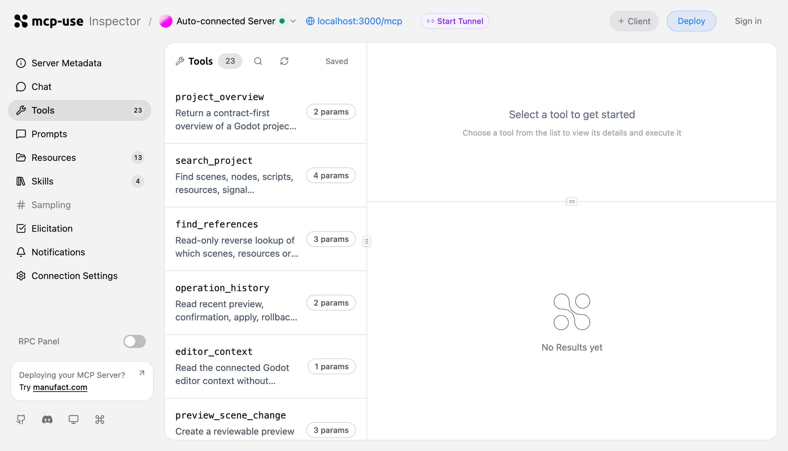

  

<h1 align="center">Godot Safe Change MCP</h1>

  让 Agent 以可预览、可确认、可回滚的方式参与 Godot 开发。

  
  
  
  

<a href="README.en.md">English</a> · 简体中文

Godot Safe Change MCP 是一个面向 Agent 的 MCP Server：TypeScript 负责工具契约、预览计划、确认、任务编排和审计；Godot EditorPlugin 负责真实编辑器上下文、UndoRedo、运行控制和诊断采集。

它不把 Godot 暴露成任意 RPC，而是把一次变更约束成一条可验证的闭环：

> 读取上下文 → 生成 Diff → 用户确认 → 获取项目 Lease → 通过 Godot UndoRedo 应用 → 运行/验证 → 安全回滚

  

真实本地 MCP Inspector 工具面板；Godot EditorPlugin 连接后，工具会读取当前场景和编辑器状态。

## 为什么使用它

- **面向意图，而不是任意 RPC**：Agent 请求的是创建、移动、实例化、修改属性、运行和验证等受限操作。
- **每次写入都有证据**：Preview Diff、expected revision、用户确认、operation ID、Godot UndoRedo 和 rollback report 串成完整记录。
- **适合多窗口协作**：项目 Lease、heartbeat、TTL 接管和稳定的 PROJECT_BUSY 防止两个 MCP 进程互相覆盖。
- **真实 Godot 验证**：GitHub Actions 在 Godot 4.5.1 与 4.7.2 上运行同一套 EditorPlugin fixture smoke。

## Quick Start

### 环境要求

- Node.js 22.22.2 或更新版本
- Godot 4.x 编辑器；CI 当前验证 4.5.1 与 4.7.2
- 一个支持 MCP 的 Agent 客户端

### 1. 安装并启动 MCP Server

~~~bash
git clone https://github.com/LJH-snow/godot-safe-change-mcp.git
cd godot-safe-change-mcp
npm ci
npm run build
npm run dev
~~~

开发服务器提供：

- MCP endpoint：<code>http://127.0.0.1:3000/mcp</code>
- Inspector：<code>http://127.0.0.1:3000/mcp/inspector</code>
- Godot bridge：默认 <code>http://127.0.0.1:8765</code>

如需更换桥接地址，设置 <code>GODOT_BRIDGE_URL</code>：

~~~bash
GODOT_BRIDGE_URL=http://127.0.0.1:8765 npm run dev
~~~

### 2. 安装 Godot 插件

把本仓库的 <code>godot-plugin</code> 复制到目标项目：

~~~text
your-godot-project/addons/godot-safe-change-bridge/
~~~

打开 Godot 后，在 Project → Project Settings → Plugins 中启用 **Godot Safe Change Bridge**。插件只监听 loopback 地址 <code>127.0.0.1:8765</code>，不会向公网暴露编辑器。

### 3. 连接 MCP 客户端

在客户端添加 Streamable HTTP MCP Server：

~~~text
http://127.0.0.1:3000/mcp
~~~

也可以直接运行已构建的入口：

~~~bash
npm run build
node bin/mcp-server.mjs
~~~

## 第一次尝试

连接成功后，可以从只读操作开始：

~~~text
读取当前 Godot 编辑器上下文和完整场景树。
搜索项目中所有与 Player 或 PackedScene 相关的节点、脚本和资源。
查找哪些场景或脚本引用了 res://scripts/player.gd。
~~~

一个完整的安全写入流程如下：

1. 调用 <code>preview_scene_change</code> 生成计划和 Diff。
2. 检查 target、NodePath、属性变化和 expected revision。
3. 调用 <code>confirm_scene_change</code> 明确确认。
4. 调用 <code>apply_scene_change</code>，由插件通过 Godot UndoRedo 执行。
5. 调用 <code>run_current_scene</code>、<code>verify_scene_state</code> 或 <code>verify_diagnostics</code> 收集证据。
6. 需要撤销时调用 <code>rollback_scene_change</code>；revision 不一致时系统会拒绝覆盖用户修改。

## 工作流

~~~mermaid
flowchart LR
    A[Agent / MCP Client] --> B[Godot Safe Change MCP]
    B --> C[Read context and search]
    C --> D[Preview + Diff]
    D --> E[User confirmation]
    E --> F[Task lease + revision guard]
    F --> G[Loopback EditorPlugin]
    G --> H[Godot UndoRedo / bounded file change]
    H --> I[Run scene and collect diagnostics]
    I --> J[Verify state or diagnostics]
    J --> K[Rollback or continue]
    K --> F
~~~

## 能力地图

| 领域 | 能力 | 说明 |
| --- | --- | --- |
| 项目理解 | <code>project_overview</code>、<code>search_project</code>、<code>find_references</code> | 搜索场景、节点、脚本、资源、信号、输入和反向引用；编辑器离线时使用本地只读索引。 |
| 编辑器上下文 | <code>editor_context</code> | 返回完整当前场景树、选中节点安全属性、打开资源、运行状态和诊断。 |
| 场景结构 | create、delete、reparent、rename、duplicate、instantiate | 所有 NodePath、名称、父子关系和实例源路径都经过边界校验。 |
| 场景内容 | <code>scene.set_property</code>、<code>scene.attach_script</code>、<code>scene.detach_script</code> | 仅开放 visible、position、size、text、color，以及项目内现有 GDScript 的挂载/卸载。 |
| 文件/设置 | resource reference、input action、script range | 使用文件或 project.godot revision guard，原子写入并支持 rollback。 |
| 运行诊断 | <code>run_current_scene</code>、<code>run_scene</code> | 返回 run ID、状态、输出、warning、error、source、line 和 NodePath。 |
| 多步骤任务 | create/get/advance/pause/resume/cancel | 支持 verify_scene_state、verify_diagnostics、诊断修复预览和 step-level operation ID。 |
| 并发恢复 | acquire/renew/release task lease、<code>task_status</code>、<code>task_timeline</code> | Lease 持有期间 heartbeat 续租；进程崩溃后按 TTL 接管，并保留审计时间线。 |

## 安全模型

### 写操作生命周期

~~~text
preview → confirm → lease/revision check → apply → verify → rollback (when needed)
~~~

### 明确禁止

- 任意 Agent 生成的 GDScript 执行
- shell、Python worker 或任意系统命令执行
- 任意 Godot RPC、方法名或对象反射
- 不受限制的文件系统写入
- 绕过 preview、confirm、revision、lease 或 rollback 的写入

### 并发行为

同一项目的短期 apply/rollback lease 和跨步骤 task lease 都存放在用户状态目录，不写入 Godot 项目。另一个窗口持有有效 lease 时，操作稳定返回 <code>PROJECT_BUSY</code>；owner 进程崩溃后，其他窗口只能在 TTL 到期后接管。

## 测试与 CI

本地质量门禁：

~~~bash
npm test
npm run typecheck
npm run build
npm run package:check
git diff --check
~~~

本地有 Godot 编辑器时运行真实 bridge smoke：

~~~bash
GODOT_BIN=/path/to/Godot node tests/godot-runtime-smoke.mjs
~~~

GitHub Actions 对每个推送运行四个 job：

- <code>check</code>：Node.js typecheck、回归测试和 build
- <code>npm package boundary</code>：验证实际发布 tarball 不包含源码、测试和内部文档
- <code>Godot 4.5.1 runtime</code>：真实 EditorPlugin fixture smoke
- <code>Godot 4.7.2 runtime</code>：同一 fixture 的第二版本验证

Smoke 覆盖 search、context、场景属性/结构/实例化/脚本 apply-rollback、资源和输入设置、diagnostics、task lease、双 MCP 进程并发和 TTL 接管。

## 开发者入口

~~~bash
npm ci
npm run dev          # Inspector + MCP endpoint
npm run typecheck
npm test
npm run build
npm run package:check
~~~

推荐先阅读：

- [发布清单](docs/RELEASE.md)
- [测试边界与 Godot 手工验收](tests/README.md)
- [完整产品计划](docs/PLAN.md)
- [Godot 插件说明](godot-plugin/README.md)
- [英文 README](README.en.md)

## License

[MIT](LICENSE)
